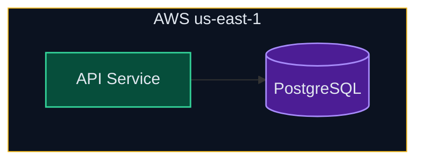
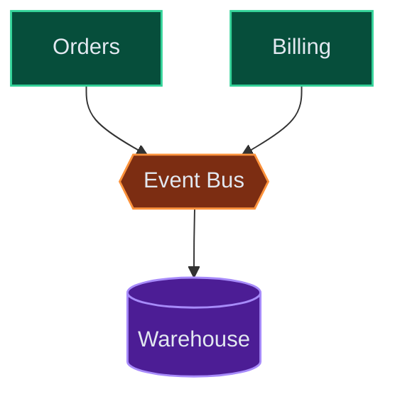
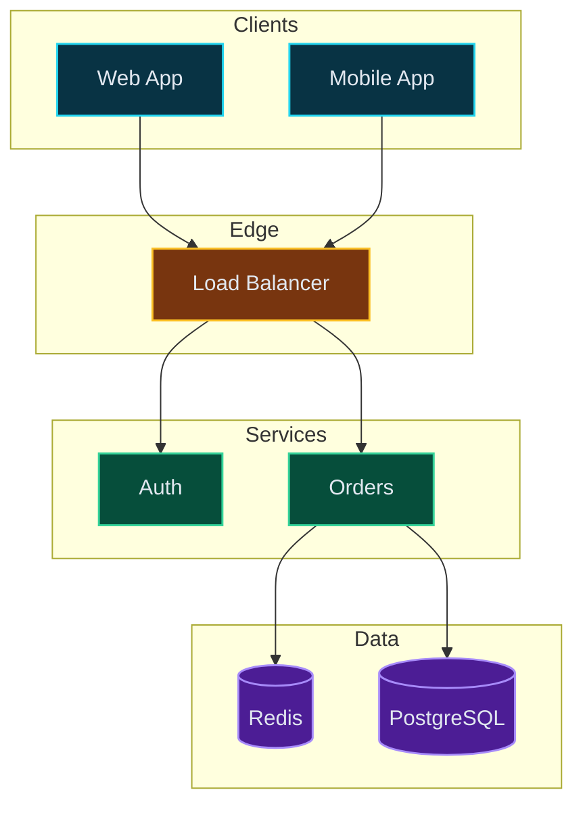

# Architecture Diagrams in Mermaid

Translate the layering and grouping instincts of a good architecture diagram into Mermaid idioms. The renderer owns pixel layout, spacing, and routing; your job is the semantic structure.

## Engine choice

- **`flowchart` (LR/TD) with `subgraph`** is the workhorse. It gives you layers, nested regions, labeled edges, and the full `classDef` palette. Prefer it for almost all architecture diagrams.
- **`architecture-beta`** is an option for simple service-and-group maps (services, groups, junctions, edges). It has limited layout control, so reach for it only when the diagram is a flat set of grouped services.

## Flow direction

Pick one primary direction and keep edges flowing that way:

- **`flowchart LR`** — data pipelines and request flows. Clients on the left, data stores on the right.
- **`flowchart TD`** — layered stacks. Clients at the top, infrastructure at the bottom.

Place databases and storage at the end of the flow (right in LR, bottom in TD).

## Layering algorithm

1. Group components by role: clients, edge/gateway, services, data, infrastructure.
2. Give each layer (or each shared-infrastructure region) its own `subgraph`.
3. Connect layers with edges that follow the primary direction.
4. Apply the semantic palette (see the `draw` skill "Semantic styling"): `frontend`, `backend`, `db`, `infra`, `connector`, `external`.

## Region boundaries

A `subgraph` is a region boundary. Style it to match the palette, and nest subgraphs for multi-region or multi-cloud (outer = provider, middle = region/VPC, inner = AZ/subnet):

## Message / event bus

Mermaid has no "bus bar". Model a shared bus as a single connector node that producers and consumers attach to:

## Edges

- Keep edges meaningful. Label only when the label adds information (`-->|writes|`, `-->|gRPC|`).
- Keep the direction consistent; avoid back-edges unless they model real feedback.
- For secondary or async links, use dashed edges `-.->`.

## Worked example (layered, TD)

