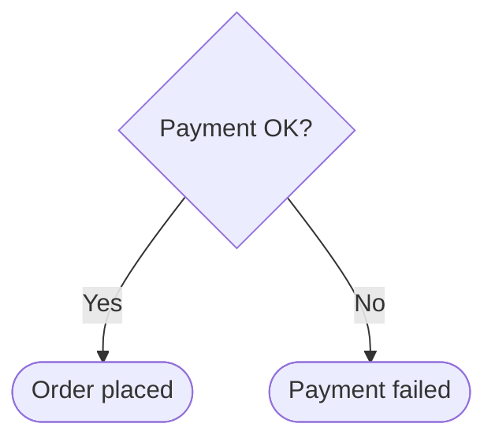
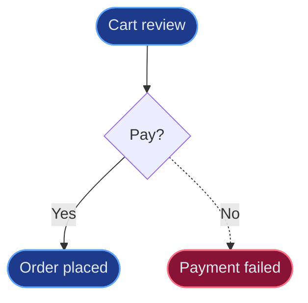
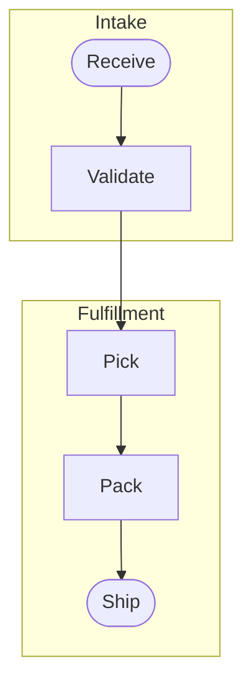

# Flowcharts in Mermaid

The renderer handles routing and spacing; you choose shapes, direction, and which path is the happy path.

## Direction

Primary flow is **top-to-bottom** (`flowchart TD`). Branches off decisions go left/right, and Mermaid routes them automatically. Use `flowchart LR` only for short, naturally horizontal flows.

## Shape vocabulary

| Meaning | Mermaid |
|---|---|
| Start / End | `([Start])` stadium |
| Process / action | `[Do the thing]` |
| Decision | `{Condition?}` |
| Input / output | `[/User input/]` parallelogram |
| Data store | `[(Database)]` cylinder |
| Subroutine | `[[Subprocess]]` |

## Decisions

Label the exit edges, not the diamond:

## Happy path and errors

- Tag the main path with the `highlight` class (see the `draw` skill "Semantic styling").
- Route error and exception edges with dashed arrows `-.->`, and tag failure nodes with `alert`.

## Merges and loop-backs

Point an edge back to the target node and Mermaid routes the merge or loop. Do not try to hand-place connectors or route them around boxes.

## Keep it shallow

- Avoid deeply nested branching when a flatter path works.
- Prefer short node labels; keep prose out of nodes.
- For 10+ steps, group phases with `subgraph` blocks to act as swimlanes:

