# ZenUML Language Guide

This reference is a concise working summary of the official ZenUML docs for this repo's skill flow.

Primary sources:

- [ZenUML docs root](https://github.com/ZenUml/docs/tree/main/docs)
- [Participant and Group](https://github.com/ZenUml/docs/blob/main/docs/language-guide/participant-and-group.md)
- [Participant Types](https://github.com/ZenUml/docs/blob/main/docs/language-guide/participant-types.md)
- [Messages](https://github.com/ZenUml/docs/blob/main/docs/language-guide/messages.md)
- [Loops](https://github.com/ZenUml/docs/blob/main/docs/language-guide/loops.md)

## Participants

- Participants can be introduced implicitly by first use.
- Participant order follows first appearance unless you declare participants earlier.
- You can declare participants up front:

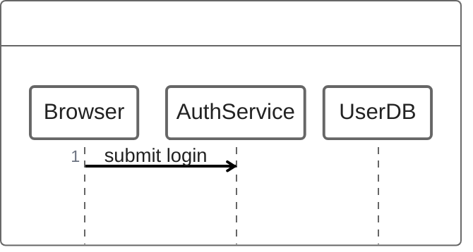

- You can group participants:

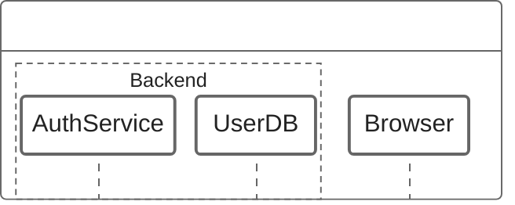

## Participant annotations

Use annotations when you want shaped participants:

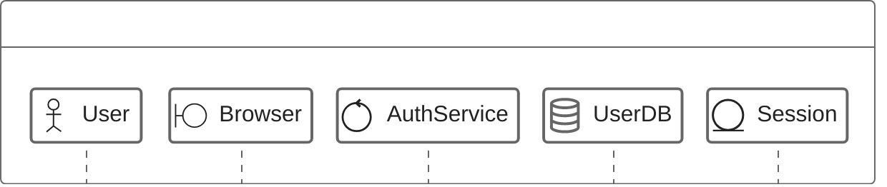

The docs also list cloud-style annotations such as `@EC2`, `@ECS`, `@RDS`, `@S3`, `@IAM`, and `@Lambda`.

## Messages

Async message:

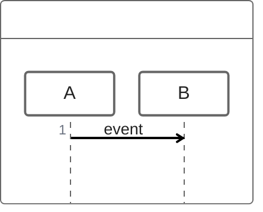

Sync message:

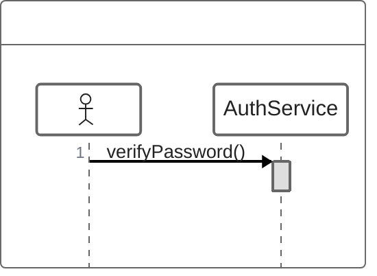

Nested sync call:

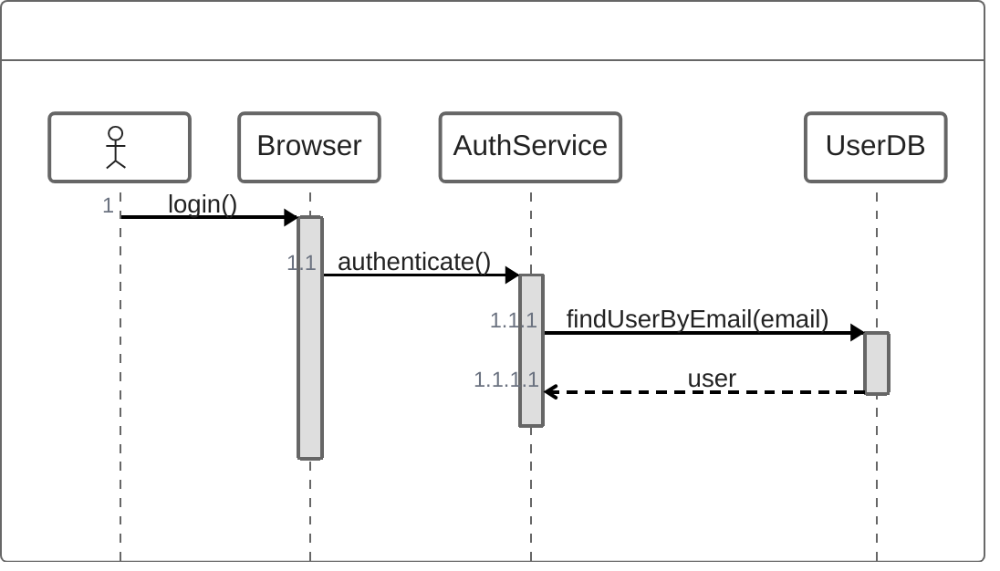

Reply forms from the docs:

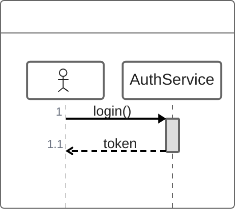

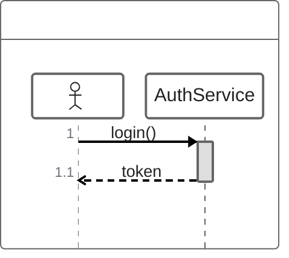

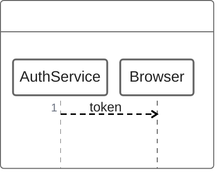

Object creation:

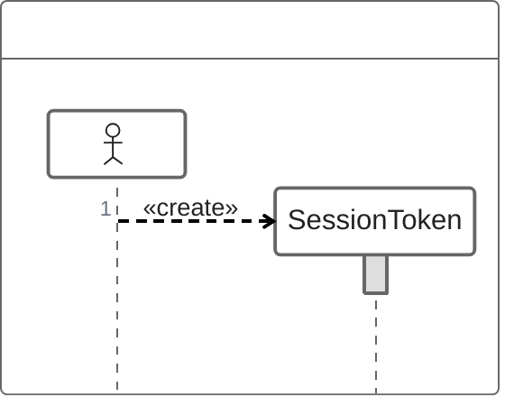

## Control flow

Branching:

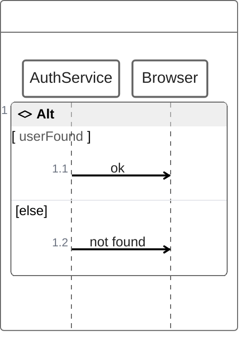

Loops:

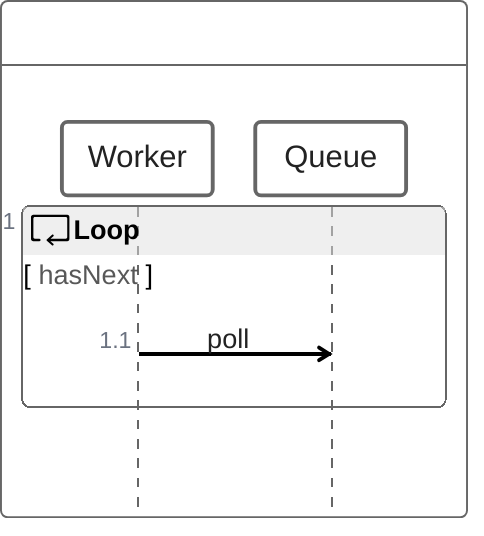

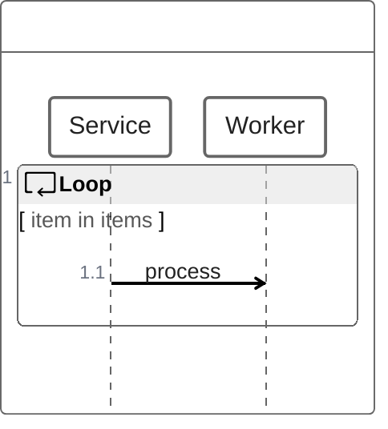

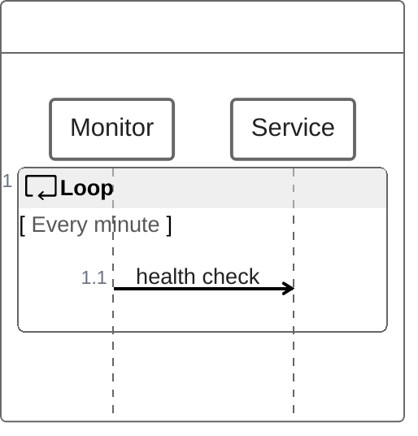

## Drafting guidance for this repo

- Stay in ZenUML syntax. Do not mix in Mermaid-native `sequenceDiagram` constructs such as `participant`, `actor`, `autonumber`, or `alt/else/end`.
- Prefer sync-style assignment or nested sync blocks when one step returns data used by later steps.
- Use async arrows for notifications, requests, and responses that are best modeled as one-way messages.
- Keep conditions code-like, for example `if(userFound)` or `if(status == ok)`, rather than natural-language phrases.
